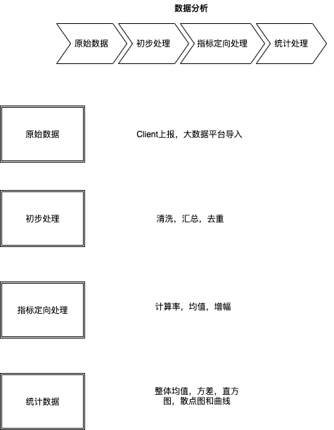

# 关于产品数据的一些思考

现状和问题

现在的现状，数据处理，一方面由于大数据平台对业务了解的不够，不确定。另一方面产品本身对数据分析的工具也了解不够，造成数据只有曲线输出，趋势分析。很多内容本身的分析，对比分析，成分分析以及均值分析都相对缺乏。
公司的大数据平台，作为公共资源平台，无法深度接入业务，并且大数据平台的工程师更多的是专注于，原始数据采集和数据初步处理，而指标性处理和统计数据方面的输出非常少，本质上来讲，现在的业务方对数据需求深度不足够，而大数据平台那边也不可能主动输出，导致现在的数据，更多的是对结果展示，对原因分析远远不够。

### 问题
* 缺少核心问题和核心指标，缺少指标间关联性和权重
* 数据平台不介入业务，缺乏数据工具
* 流程上缺少足够的步骤

### 解决方案
* 以一个综合，包含权重的复合数来描述结果，这个数字可以是一些指标的权重计算得到，然后经过大家一起分析明确。
* 确认目标后，明确数据清洗和初步处理数据。产品技术需要协同确认指标和计算规则
* 进行数据分类和数据分组，如果有漏斗模型或者梯度模型，可以依据模型分组。
* 计算指标数据，同时进行统计数据计算和统计工具进行分析