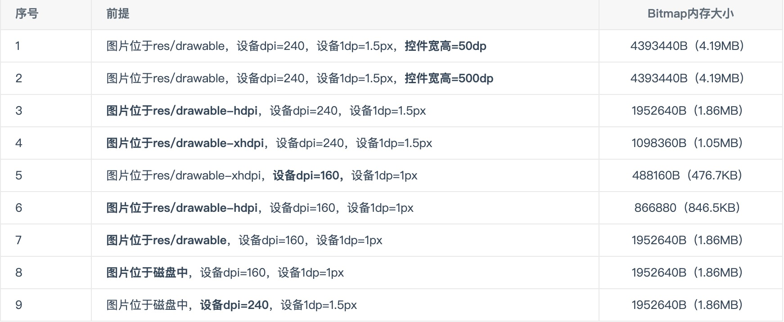

# Android中一张图片占据的内存大小是如何计算

博客原地址：https://www.cnblogs.com/dasusu/p/9789389.html


**一张图片物理内存大小为55.8KB的PNG，它在内存大小是多少呢，也是55k**

```
图片内存公式 = 分辨率 * 每个像素点大小
```

这个公式是没毛病的，但真实的情况比我想的复杂的多。



```
ALPHA_8:1B
RGB_565:2B
ARGB_4444:2B
ARGB_8888:4B
RGBA_F16:8B
```

所以理论值的确是：1.86M ≈ 1080  * 452 * 4B (ARGB_8888:4B)


ARGB_8888:4B 是现在比较好的图片格式，现行fresco ， glide 以及 Picasso都是默认使用的ARGB_8888 。 


开源库内部都有一些具体优化，留待补充。