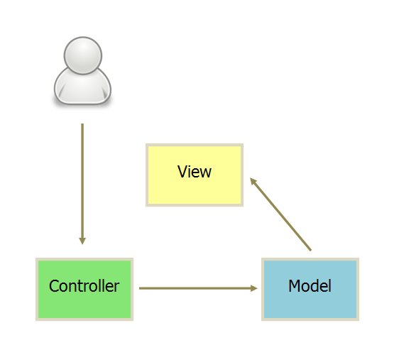
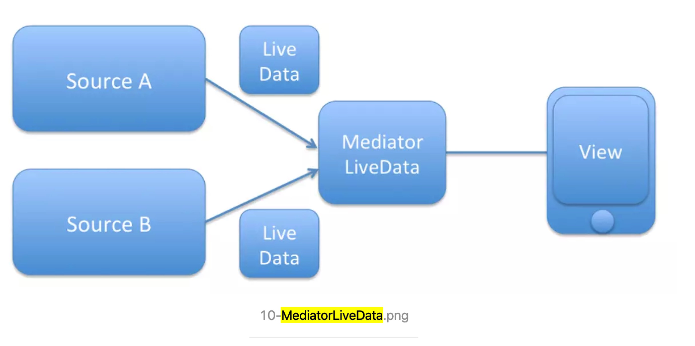

# Android对于JetPack全家桶的探索

详细代码请参考个人项目：

https://github.com/zllbird/picReadDemo

Android的jetpack进阶

- 一些前提

- - kotlin基础

  - kotlin中的委托语法

  - jetpack最佳实践

  - - 原则

    - - 不应在应用组件（包括 Activity、Fragment、Service、内容提供程序和广播接收器）中存储任何应用数据或状态，并且应用组件不应相互依赖
      - 分离关注点。一种常见的错误是在一个 Activity 或 Fragment 中编写所有代码。您并非拥有 Activity 和 Fragment 的实现；它们只是表示 Android 操作系统与应用之间关系的粘合类
      - 通过模型驱动界面（最好是持久性模型）。模型是负责处理应用数据的组件。它们独立于应用中的 View 对象和应用组件，因此不受应用的生命周期以及相关的关注点的影响。

    - 推荐实践

    - - 

      - 每个组件仅依赖于其下一级的组件

      - - Activity         和 Fragment 仅依赖于视图模型。
        - 存储区依赖于持久性数据模型和远程后端数据源。
        - 存储区是唯一依赖于其他多个类的类；

      - 构建

      - - 数据库会充当单一可信来源？
        - 网络决策树

- - - - - -  

- DataBinding

- - 配置xml文件，以`<layout>`包含`<data>`和一个视图`例：FrameLayout`。自动生成以xml文件命名的xxxxBinding类，用于在activity或者fragment中使用的binding类
  - 如果发现找不到这个binding类或者编译binding类出错，大概率是因为xml文件中有错误。
  - 泛型在xml中，注意用 `&lt;`替代< ::: 用`&gt;`替代>

- ViewModel

- - 前提：MVVM

  - - 聊VM之前，要简单聊两句MVVM。

- - - MVC

- - - 
    - 以上算是MVC交互的两种方式吧，但实际上，我们用的最多的还是下面这种。

- - - Android提供的本质上是，View(xml),Activity,Model(实体模型（数据的获取、存储、数据状态变化）)，这么算下来，MVC分别对应的关系是

    - - M：实体模型（数据的获取、存储、数据状态变化）
      - V：xml
      - C：Activity 以及处理数据，UI等等

    - 这最直接的结果就是，V很薄，就一个xml文件，逻辑非常非常少，M也很简单，自然而然重任全落在了Activity里。所有的交互，UI通信，和事件响应都又C层管理。所以我们就能知道为什么所有的代码都写在Activity中了，一不小心上千行代码出去了。事实上，View的核心也是Activity承接的，所以也不难理解图上View和Model的互相通信

    - MVP

- - - 上图是MVP的一个叫通信交互图。很明显，VM之间没有通信，对的。极大的解耦了逻辑层和View层。在Android的具体实现中，是构建一个抽象的VIew接口将Presenter和真正的VIew解耦，Persenter持有该View接口，对该接口进行操作，而不是直接操作View层。这样就可以把视图操作和业务逻辑解耦，从而让Activity成为真正的View层。

    - 但这也带来了问题

    - - Presenter做了太多事儿。臃肿的代码问题依然在。
      - 因为所有的通信都是经过Presenter接口进行交互的，所以，这个接口定义成了大问题，定的太细逻辑是解耦了，但碎片化就严重了，而且复用性也是问题，定义太粗，解耦就又是问题，这个度是真的难把握。
      - 很多接口是和UI相关的，MVP本身是UI和事件驱动的模型，数据都是被动地通过UI控件做展示的。
      - 所以，UI一旦大动干戈，基本是对应的接口都要动，Presenter和Activity的改动就会非常大，这也算解耦问题。

    - MVVM

    - 

    - 主角上场。先看图，似乎和上图一个样子。好像和MVP没啥区别呀，就是Presenter换成了ViewModel。等等，好像还有个箭头不一样，又好像一样。这是从jake大神那里偷来的图，这个图真是画的太好了，一语道破MVVM的真谛。

    - 这个箭头是一个双向箭头，和我们这些图中的剩下箭头是单方向的。这也是VM真正的作用，双向绑定。

    - 换成大白话说，VM和View之间没有通信，View的变动，自动反映在 VM上，反过来，VM任何变动也会自动映射到View上。

    - 再加句大白话，这样，Model可以直接驱动UI，而MVVM最大的优势之一就是数据驱动。

  - 解决问题

  - - 解决问题1：ViewModel 类旨在以注重生命周期的方式存储和管理界面相关的数据。ViewModel 类让数据可在发生屏幕旋转等配置更改后继续存在。大白话是：将生命周期和数据解耦。
    - 解决问题2：内存泄漏。由于异步进行的事儿，和生命周期冲突的时候，百分百内存泄漏。以前需要大量的代码维护。
    - 

  -  

- LiveData

- - LiveData 没有公开可用的方法来更新存储的数据。MutableLiveData 类将公开 setValue(T) 和 postValue(T) 方法，如果您需要修改存储在 LiveData 对象中的值，则必须使用这些方法。通常情况下会在 ViewModel 中使用 MutableLiveData，然后 ViewModel 只会向观察者公开不可变的 LiveData 对象。

  - LiveData核心就是承当被观察的数据。

  - - LiveData 在VM中，面向Activity或fragment只作为数据提供，提供但不能更改不能设置，只是提供。所以UI很多相关的设置，只能提供数据不允许更改。
    - LiveData 在VM中，面向数据源，作为源。

  - MediatorLiveData 可以用于多源选择模式。

  - - 如图

- - - 需要注意的是：当       Fragment 不 再处于 active 状态时，如果 LiveDataA 和 LiveDataB 的数据都发生了变化，那么当 Fragment 重新恢复 active 状态时，MediatorLiveData 将获取最后添加的 LiveData 的数据发送给 Fragment，这里即 LiveDataB。

- Dragger2

- - 原则核心：依赖注入

  - 现状：Dagger是通过Component来确认需求与依赖对象的，可以说Component是他们之间的纽带。如果各位用过Dagger2或者了解过Dagger2的教程的话，那么一定知道，Dagger2的使用方式是十分繁琐的，每个需要用到依赖注入的地方都需要通过编写DaggerxxxComponent的模版代码来实现依赖注入。要写非常多的模版代码，大大增加了系统的复杂度。笔者在使用Dagger 2.17的时候，发现Google对Dagger 2进行了优化，现在使用Dagger实现依赖注入要写的代码其实非常少，并且复杂度已经有了很大程度的降低了。

  - 优势

  - - 减少代码量，提高工作效率
    - 自动处理依赖关系
    - 采用静态编译，不影响运行效率
    - 提高多人编程效率

  - 核心理解：Dragger2的核心是注解方式的关联实现注入。

  - - `@ContributesAndroidInjector`       Dagger2是否要自动把需要的用到的Modules注入到DishesFragment中。这个注解是Dagger2 For Android简化代码的关键
    - `@Module` 被这个注解标记的类可以看作为依赖对象的提供者，可以通过这个被标记的类结合其它注解来实现依赖关系的关联。
    - `@Provides` 主要作用就是用来提供一些第三方类库的对象或提供一些构建非常复杂的对象在Dagger2中类似工厂类的一个角色。
    - `@Binds` 主要作用就是确定接口与具体的具体实现类。

  - 自己理解

  - - providers 来标记具体提供的实例，提供对象需要的数据，并提供创建好的对象进入表里，方便获取
    - ContributesAndroidInjector       来标记那个类具体需要使用依赖注入的功能。更常见的是Activity/fragment，接受者，这种通过@Inject，被注入一些成员变量
    - Component 注射器。定义module类是被注入注射的类，使用@Inject注入到另一个对象中，或者说接受者
    - module 被这个注解标记的类可以看作为依赖对象的提供者，可以通过这个被标记的类结合其它注解来实现依赖关系的关联。
    - Application 构建注射器的。

- Room

- - TODO

- 思考

- - TODO