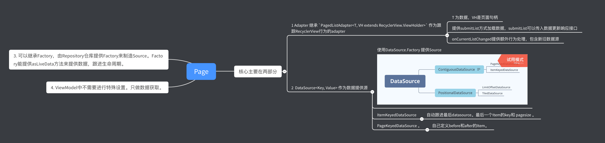

### Android Jetpack 分页库概览Paging

### 介绍

[官方介绍](https://developer.android.com/topic/libraries/architecture/paging#top_of_page)

分页库可帮助您一次加载和显示一小块数据。按需载入部分数据会减少网络带宽和系统资源的使用量。




### 逻辑


### 核心步骤

- 核心主要在两部分

  - 1 Adapter 继承 `PagedListAdapter<T, VH extends RecyclerView.ViewHolder>` 作为跟踪RecyclerView行为的adapter

    - T 为数据，VH是页面句柄
    - 提供submitList方式加载数据，submitList可以传入数据更新响应接口
    - onCurrentListChanged提供额外行为处理，包含新旧数据源

  - 2 DataSource<Key, Value> 作为数据提供源

    - 使用DataSource.Factory 提供Source

      

    - ItemKeyedDataSource

      - 自动跟进最后datasource。最后一个Item的key和 pagesize 。

    - PageKeyedDataSource 。

      - 自己定义before和after的Item。

- 可以继承Factory，由Repository仓库提供Factory来制造Source。Factory能提供asLiveData方法来提供数据，跟进生命周期。

- ViewModel中不需要进行特殊设置。只做数据获取。

- DataSource.Factory 有支持toLiveData的方法，并添加了config方便配置。

  - pageSize = 10（每页个数）
  - prefetchDistance = 6 （预加载前置数，相当于count-prefetchDistance进行预加载）
  - enablePlaceholders = false（数据不完全苦丁，可能会跳动修改等，所以false不锁数据）
  - initialLoadSizeHint = 30 (首次数据页码数))
  - fetchExecutor = appExecutors.networkIO() 提供参数

```kotlin
fun cardOfBGBDPageSize(bgId:String, pageSize:Int): Listing<Card>{
        val sourceFactoru = BGPageSizedDataSourceFactory(apiService)
        val pagedList = sourceFactoru.toLiveData(
            config = Config(
                pageSize = 10,
                prefetchDistance = 6,
                enablePlaceholders = false,
                initialLoadSizeHint = 30
            ),
            fetchExecutor = appExecutors.networkIO()
        )
        return Listing(
            pagedList = pagedList,
            networkState = sourceFactoru.sourceLiveData.switchMap {
                it.initialLoad
            }
        )
    }
```


### 思考

1. 列表分页已属于一级需求，基本有feed流必有
2. 和ViewModel和LiveData一起，数据和生命周期解耦
3. 可以配置参数实现预加载
4. Paging的成熟度很高，官方提供的实现很高