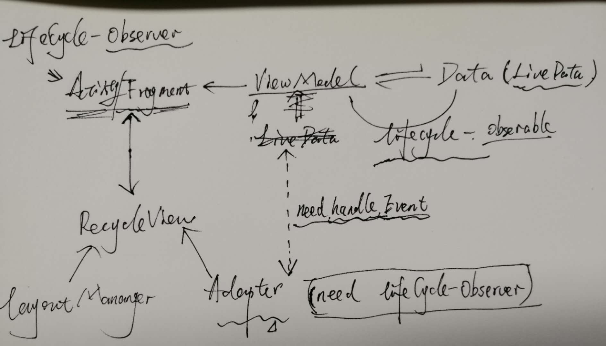

# RecycleView和Lifecycle，如何使用观察数据 
### 问题

（自己画的，主要领会精神）
很明显，实际项目中，往往`RecycleView`主要承载展示和发出UI事件。这对于`Adapter`的要求就高了。
因为JetPack中建议，始终是**分离关注点**和**基于数据驱动界面**。所以要VM中的LiveData数据不仅要驱动Activity/Fragment，同时也要能驱动`RecycleView `的`Adapter`，自然的，`Adapter `要能是观察者了。
`Adapter`中`ViewHolder`是界面逻辑主要承载者，所以自然它最合适。改造一下，让VM注册为LifecycleOwner的观察者。

```kotlin
/**
 * A generic ViewHolder that works with a [ViewDataBinding].
 * @param <T> The type of the ViewDataBinding.
</T> */
class DataBoundViewHolder<out T : ViewDataBinding> constructor(val binding: T) :
    RecyclerView.ViewHolder(binding.root) , LifecycleOwner{
    private val lifecycleRegistry = LifecycleRegistry(this)
    private var wasPaused: Boolean = false

    init {
        lifecycleRegistry.currentState = Lifecycle.State.INITIALIZED
    }

    fun markCreated() {
        lifecycleRegistry.currentState = Lifecycle.State.CREATED
    }
    fun markAttach() {
        if (wasPaused) {
            lifecycleRegistry.currentState = Lifecycle.State.RESUMED
            wasPaused = false
        } else {
            lifecycleRegistry.currentState = Lifecycle.State.STARTED
        }
    }
    fun markDetach() {
        wasPaused = true
        lifecycleRegistry.currentState = Lifecycle.State.CREATED
    }
    fun markDestroyed() {
        lifecycleRegistry.currentState = Lifecycle.State.DESTROYED
    }

    override fun getLifecycle(): Lifecycle {
        return lifecycleRegistry
    }

}
```
然后，在Adapter的，`onCreateViewHolder，onViewAttachedToWindow,onViewDetachedFromWindow`中绑定对应的数据变更。
``` kotlin
abstract class DataBoundListAdapter<T, V : ViewDataBinding>(
    appExecutors: AppExecutors,
    diffCallback: DiffUtil.ItemCallback<T>
) : PagedListAdapter<T, DataBoundViewHolder<V>>(
    AsyncDifferConfig.Builder<T>(diffCallback)
        .setBackgroundThreadExecutor(appExecutors.diskIO())
        .build()
) {

    private val holders : MutableList<DataBoundViewHolder<V>> = mutableListOf()

    override fun onCreateViewHolder(parent: ViewGroup, viewType: Int): DataBoundViewHolder<V> {
        val binding = createBinding(parent)
        val holder = DataBoundViewHolder(binding)
        binding.lifecycleOwner = holder
        holder.markCreated()
        holders.add(holder)
        return holder
    }

    override fun onViewAttachedToWindow(holder: DataBoundViewHolder<V>) {
        super.onViewAttachedToWindow(holder)
        holder.markAttach()
    }

    override fun onViewDetachedFromWindow(holder: DataBoundViewHolder<V>) {
        super.onViewDetachedFromWindow(holder)
        holder.markDetach()
    }

    protected abstract fun createBinding(parent: ViewGroup): V

    override fun onBindViewHolder(holder: DataBoundViewHolder<V>, position: Int) {
        bind(holder.binding, getItem(position)!!,position)
        holder.binding.executePendingBindings()
    }

    protected abstract fun bind(binding: V, item: T, position: Int )

    fun destory(){
        holders.forEach { it.markDestroyed() }
    }
}
```
这样改造之后，就能使RecycleView的Adapter能跟随LiveData变更了。


#