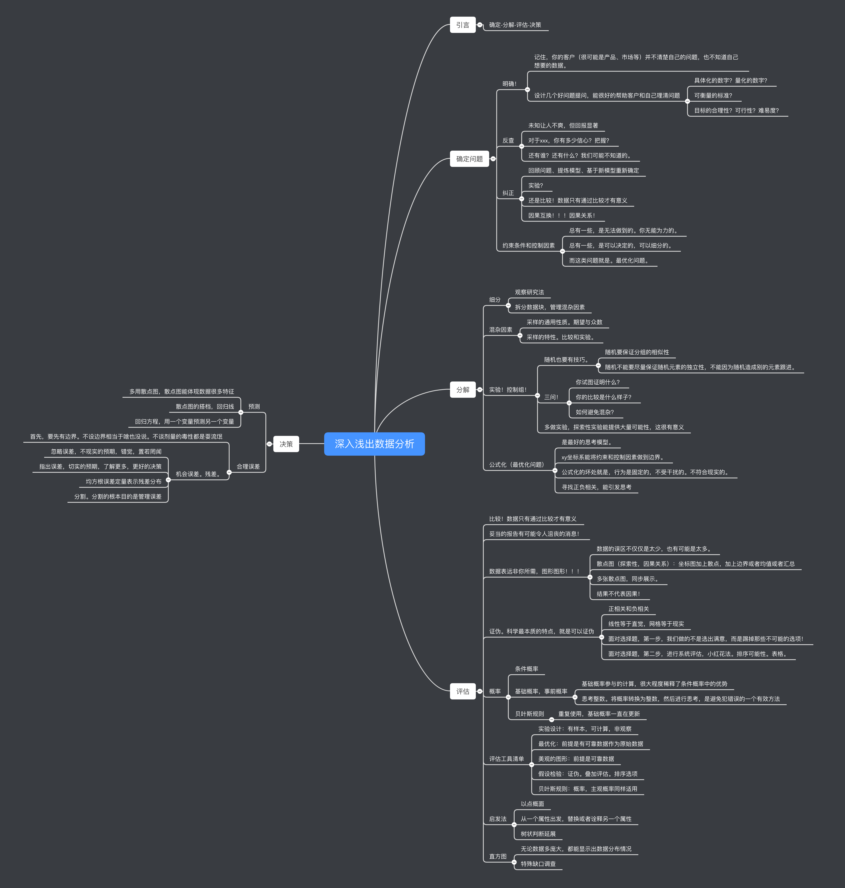

# 深入浅出数据分析

- 引言

- - 确定-分解-评估-决策

- 确定问题

- - 明确！

  - - 记住，你的客户（很可能是产品、市场等）并不清楚自己的问题，也不知道自己想要的数据。

    - 设计几个好问题提问，能很好的帮助客户和自己理清问题

    - - 具体化的数字？量化的数字？
      - 可衡量的标准？
      - 目标的合理性？可行性？难易度？

  - 反查

  - - 未知让人不爽，但回报显著
    - 对于xxx，你有多少信心？把握？
    - 还有谁？还有什么？我们可能不知道的。

  - 纠正

  - - 回顾问题、提炼模型、基于新模型重新确定
    - 实验？
    - 还是比较！数据只有通过比较才有意义
    - 因果互换！！！因果关系！

  - 约束条件和控制因素

  - - 总有一些，是无法做到的。你无能为力的。
    - 总有一些，是可以决定的，可以细分的。
    - 而这类问题就是。最优化问题。

- 分解

- - 细分

  - - 观察研究法
    - 拆分数据块，管理混杂因素

  - 混杂因素

  - - 采样的通用性质。期望与众数
    - 采样的特性。比较和实验。

  - 实验！控制组！

  - - 随机也要有技巧。

    - - 随机要保证分组的相似性
      - 随机不能要尽量保证随机元素的独立性，不能因为随机造成别的元素跟进。

    - 三问！

    - - 你试图证明什么？
      - 你的比较是什么样子？
      - 如何避免混杂？

    - 多做实验，探索性实验能提供大量可能性，这很有意义

  - 公式化（最优化问题）

  - - 是最好的思考模型。
    - xy坐标系能将约束和控制因素做到边界。
    - 公式化的坏处就是，行为是固定的，不受干扰的。不符合现实的。
    - 寻找正负相关，能引发思考

- 评估

- - 比较！数据只有通过比较才有意义

  - 妥当的报告有可能令人沮丧的消息！

  - 数据表远非你所需，图形图形！！！

  - - 数据的误区不仅仅是太少，也有可能是太多。
    - 散点图（探索性，因果关系）：坐标图加上散点，加上边界或者均值或者汇总
    - 多张散点图，同步展示。
    - 结果不代表因果！

  - 证伪。科学最本质的特点，就是可以证伪

  - - 正相关和负相关
    - 线性等于直觉，网格等于现实
    - 面对选择题，第一步，我们做的不是选出满意，而是踢掉那些不可能的选项！
    - 面对选择题，第二步，进行系统评估，小红花法。排序可能性。表格。

  - 概率

  - - 条件概率

    - 基础概率，事前概率

    - - 基础概率参与的计算，很大程度稀释了条件概率中的优势
      - 思考整数。将概率转换为整数，然后进行思考，是避免犯错误的一个有效方法

    - 贝叶斯规则

    - - 重复使用，基础概率一直在更新

  - 评估工具清单

  - - 实验设计：有样本，可计算，非观察
    - 最优化：前提是有可靠数据作为原始数据
    - 美观的图形：前提是可靠数据
    - 假设检验：证伪。叠加评估。排序选项
    - 贝叶斯规则：概率，主观概率同样适用

  - 启发法

  - - 以点概面
    - 从一个属性出发，替换或者诠释另一个属性
    - 树状判断延展

  - 直方图

  - - 无论数据多庞大，都能显示出数据分布情况
    - 特殊缺口调查

- 决策

- - 预测

  - - 多用散点图，散点图能体现数据很多特征
    - 散点图的搭档，回归线
    - 回归方程，用一个变量预测另一个变量

  - 合理误差

  - - 首先，要先有边界。不设边界相当于啥也没说。不谈剂量的毒性都是耍流氓

    - 机会误差。残差。

    - - 忽略误差，不现实的预期，错觉，置若罔闻
      - 指出误差，切实的预期，了解更多，更好的决策
      - 均方根误差定量表示残差分布
      - 分割。分割的根本目的是管理误差